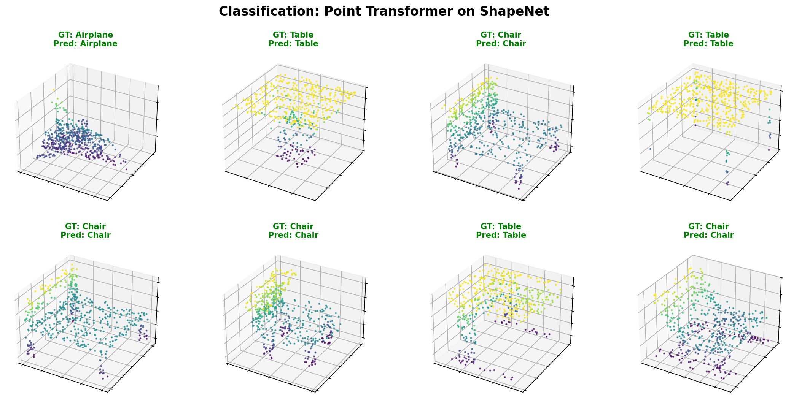
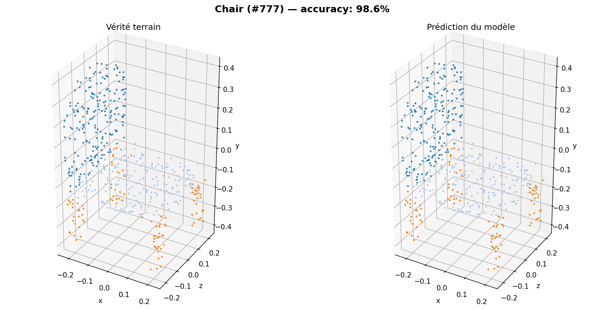
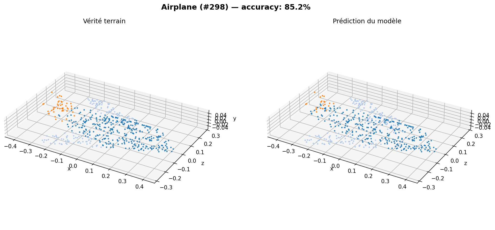
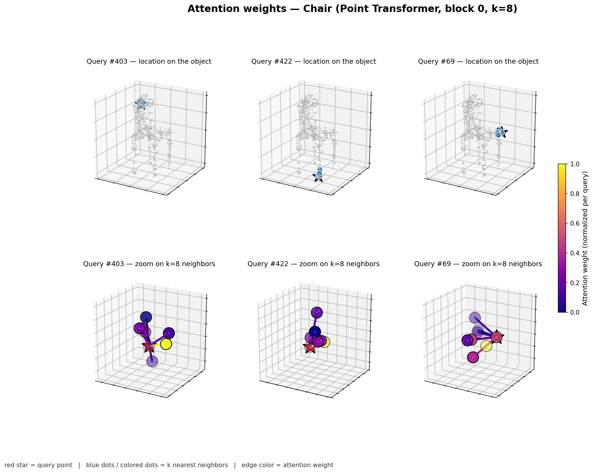

# Point Transformer on ShapeNet

PyTorch implementation of **Point Transformer** ([Zhao et al., ICCV 2021](https://arxiv.org/abs/2012.09164)) for 3D point clouds from **ShapeNet** (via [PyTorch Geometric](https://pytorch-geometric.readthedocs.io/)).

Two tasks are supported:

- **Shape classification** — predict the object category (e.g. chair, airplane).
- **Part segmentation** — per-point part labels (ShapeNet part benchmark).

The code uses a **pure PyTorch k-NN graph** and PyG's `scatter` / `softmax` utilities so you do not need `torch-cluster` or `torch-scatter` wheels.

## Results

### Classification

8 random test objects — green = correct prediction, red = wrong:



### Part segmentation

Ground truth (left) vs model prediction (right) on held-out test shapes:




### Attention visualization

Two-row figure: the **top row** shows where each query point (red star) sits on the chair, with its k=8 nearest neighbors highlighted in blue. The **bottom row** zooms on the neighborhood — edges and neighbor dots are colored by attention weight (bright = high, dark = low):



## Requirements

- **Python 3.11 or 3.12** is recommended (PyTorch has stable wheels; 3.13 may not work yet).
- macOS / Linux with enough disk space for ShapeNet (~several GB when unpacked).

## Setup

```bash
git clone <your-repo-url>
cd <repository-folder>
make install
```

This creates `.venv/`, upgrades `pip`, and installs `requirements.txt`.

## Data

Place ShapeNet Part under `./data/ShapeNet` (default), or use the helper:

```bash
make download
# or
.venv/bin/python3 download_shapenet.py --data_root ./data/ShapeNet
```

If the automatic download fails, the script prints mirror / manual options.

## Training

**Classification** (default: a few categories, small model for CPU-friendly runs):

```bash
make train
# resume from checkpoint_best.pt
make train-resume
```

**Part segmentation** (all 16 ShapeNet categories by default):

```bash
make seg
make seg-resume
```

Override hyperparameters via Makefile variables, e.g. `make train EPOCHS=30 K=16 BATCH=32`, or call `train.py` / `train_segmentation.py` with `--help`.

## Visualization

After training, generate all visual outputs:

```bash
make visualize
```

Or individually:

```bash
.venv/bin/python3 visualize.py --category Chair --save vis_seg_chair.png
.venv/bin/python3 visualize_classification.py --save vis_classification.png
.venv/bin/python3 visualize_attention.py --category Airplane --save vis_attention.png
```

## Sanity check (mesh junction faces)

A small **geometry-only** script (`sanity_check.py`) builds procedural meshes, masks a region, extracts **junction faces** and boundary edges, and saves PNG figures (useful when exploring mesh editing / infill ideas):

```bash
make sanity-check
```

## Repository layout

| Path | Role |
|------|------|
| `models/point_transformer.py` | Point Transformer blocks, classifier, segmentor |
| `data_shapenet.py` | Classification dataset wrapper + subsampling |
| `train.py` | Classification training loop + checkpointing |
| `train_segmentation.py` | Segmentation training + mIoU |
| `visualize.py` | Segmentation: ground truth vs prediction |
| `visualize_classification.py` | Classification grid on random test objects |
| `visualize_attention.py` | Attention weight visualization |
| `sanity_check.py` | Procedural mesh + junction-face visualization |
| `download_shapenet.py` | Dataset download with retries |
| `Makefile` | `install`, `download`, `train`, `seg`, `visualize`, `sanity-check`, `clean` |
